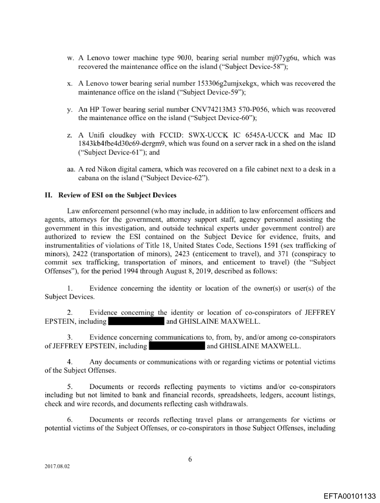
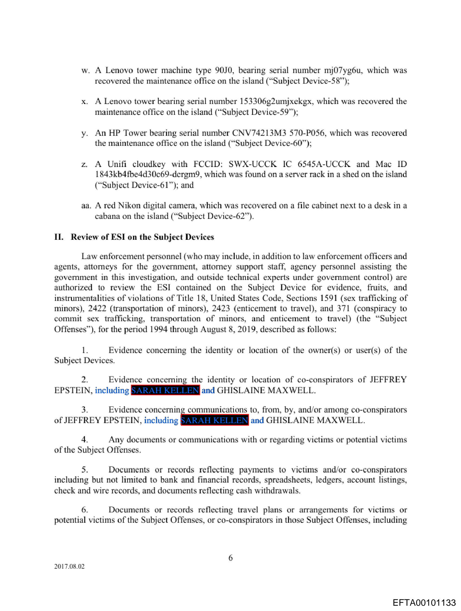

# UnRedact
UnRedact is a tool that analyzes redacted PDF files and makes best-effort guesses about hidden text.

It works by combining:
- redaction box detection,
- nearby visible text,
- PDF font/width measurements (including kerning and ligatures),
- visual scoring against the rendered page.

## Important Note
UnRedact generates guesses. It does not guarantee the true hidden text.

## Who This Is For
- Researchers and journalists
- Investigators reviewing released records
- Anyone who wants structured, repeatable analysis of redacted PDFs

## Install
1. Install Rust: https://rustup.rs
2. Clone this repository.
3. Build:

```bash
cargo build --release
```

## Quick Start (Single PDF)
Run UnRedact on one file:

```bash
cargo run --bin unredact-cli -- path/to/file.pdf --output-dir path/to/output
```

`--output-dir` is optional. If you omit it, output is written to your OS temp directory under `unredact` (for example: `%TEMP%/unredact`).

This creates:
- `file.redactions.json` (detected redaction regions)
- `file.fonts.json` (detected text/font runs)
- `file.guesses.json` (best guesses, scores, and diagnostics)

## Create a Visualized PDF
If you want an output PDF with overlays:

```bash
cargo run --bin unredact-cli -- path/to/file.pdf --output-dir path/to/output --visualize
```

This also creates:
- `file.visualized.pdf`

## Process a Whole Folder (Batch Mode)
You can pass a folder instead of a single file:

```bash
cargo run --bin unredact-cli -- path/to/folder --output-dir path/to/output
```

Batch mode now:
- scans subfolders automatically,
- processes supported files (`.pdf`) only,
- runs serially,
- always writes a JSON batch manifest to `output_dir/batch_manifest.json`.

The batch manifest includes per-file success/failure and runtime.

## Use Your Own Dictionary (Optional)
You can provide a custom dictionary file (one entry per line):

```bash
cargo run --bin unredact-cli -- path/to/file.pdf --dictionary path/to/dictionary.txt
```

If you do not provide one, UnRedact uses the built-in names list.

## Current `unredact-cli` Parameters
- `<input>`: required file or folder path
- `--output-dir <path>`: optional output folder (default: OS temp directory + `unredact`)
- `--dictionary <path>`: optional dictionary text file (one entry per line)
- `--no-image-analysis`: optional flag to disable image/raster redaction detection
- `--should-visually-score true|false`: optional toggle (default: `true`)
- `--visualize`: optional flag to write `file.visualized.pdf`

Show all `unredact-cli` options:

```bash
cargo run --bin unredact-cli -- --help
```

## Browser Version (WASM + Static Site)
You can run UnRedact directly in a browser from a static site.

### What It Does
- Upload a PDF in the browser
- Optionally upload a dictionary text file
- Run `web_entry` (bytes in, bytes out) inside WebAssembly
- Download `redactions.json`, `fonts.json`, `guesses.json`, and optional `visualized.pdf`

### Build the Web App Locally
1. Install `wasm-pack`
2. Install Binaryen (`wasm-opt`) `version_126` or newer
3. Build the wasm package:

```bash
wasm-pack build --target web --out-dir web/pkg --release --no-default-features --features "shared-bytes-workflow,web-entry"
```

4. Serve the static files in `web/`:

```bash
python -m http.server 8080 --directory web
```

5. Open `http://localhost:8080`.

### Local WASM Benchmark
You can benchmark the real `run_unredact_web` wasm path locally with Node.js.

1. Build wasm first (same command as above).
2. Run:

```bash
node scripts/wasm_local_benchmark.mjs --pdf test_data/EFTA00101126.pdf --repeats 5 --out benchmark/wasm_local_benchmark.json
```

Current script parameters:
- `--pdf <path>`: benchmark one PDF (repeatable)
- `--pdf-dir <path>`: benchmark all PDFs recursively in a folder
- `--dictionary <path>`: optional dictionary file
- `--repeats <n>`: measured runs per PDF (default: `3`)
- `--warmup <n>`: warmup runs per PDF (default: `1`)
- `--should-visually-score true|false` (default: `true`)
- `--enable-image-analysis true|false` (default: `true`)
- `--visualize true|false` (default: `false`)
- `--raster-dpi <float>` (default: `200`)
- `--visual-score-dpi <float>` (default: `200`)
- `--out <path>`: output report path

The report includes:
- wall clock latency stats (`min/mean/p50/p90/max`),
- internal stage timings parsed from diagnostics (`timing_ms stage=*`),
- output size stats,
- repeat consistency via top-guess signature stability.

### Automated Browser UI Benchmark + Memory Test
You can run an automated browser test that drives the real web UI batch flow, then validates benchmark/memory output from the page.

1. Build wasm first:

```bash
wasm-pack build --target web --out-dir web/pkg --release --no-default-features --features "shared-bytes-workflow,web-entry"
```

2. Install Playwright test tooling and Chromium once:

```bash
npm install
npm run playwright:install
```

3. Run the browser benchmark test directly:

```bash
npm run test:web-ui-benchmark
```

It writes an artifact to:
- `benchmark/web_ui_batch_benchmark.latest.json`

4. Or run it via Cargo test flow (opt-in):

```bash
UNREDACT_RUN_WEB_UI_BENCHMARK=1 cargo test --test integration_web_ui_benchmark -- --nocapture
```

Without `UNREDACT_RUN_WEB_UI_BENCHMARK=1`, that cargo test auto-skips.

### Publish to GitHub Pages
A workflow is included at:

- `.github/workflows/deploy_wasm_site.yml`

On push to `main` (or manual dispatch), it:
1. Builds the wasm package
2. Stages `web/` as the site artifact
3. Deploys to GitHub Pages

If Pages is not already enabled, enable it in repository settings and select GitHub Actions as the source.

## Accuracy Benchmark
Use this benchmark to track quality and consistency over time:

```bash
cargo run --bin guess_accuracy_benchmark -- --out benchmark/guess_accuracy.json --repeats 2 --consistency-out benchmark/guess_consistency.json
```

Current benchmark parameters:
- `--out <path>`: output JSON path (default: `benchmark/guess_accuracy.json`)
- `--repeats <n>`: number of repeated runs (default: `2`)
- `--single-run`: shorthand for `--repeats 1`
- `--determinism`: shorthand for `--repeats 3`
- `--require-deterministic`: exits with error if repeated runs differ
- `--consistency-out <path>`: optional consistency report path

This reports:
- recall and ranking metrics,
- visual error metrics,
- stage timing metrics,
- run-to-run consistency metrics.

Use `--determinism` as shorthand for `--repeats 3`.

Show benchmark options:

```bash
cargo run --bin guess_accuracy_benchmark -- --help
```

## PDF to PNG Helper
Use this to convert PDF pages into PNG images (useful for documentation and visual checks):

```bash
cargo run --bin pdf_to_png -- path/to/file.pdf --page 2 --dpi 200
```

Current `pdf_to_png` parameters:
- `<input>`: required PDF path
- `--page <n>`: 1-based page number for single page mode (default: `1`)
- `--all-pages`: render every page
- `--output <path>`: output file path (single page mode)
- `--output-dir <path>`: output directory (default: input file directory)
- `--dpi <float>` (default: `200`)

Show options:

```bash
cargo run --bin pdf_to_png -- --help
```

## Example
Original sample (page 8):



Visualized sample (page 8):


