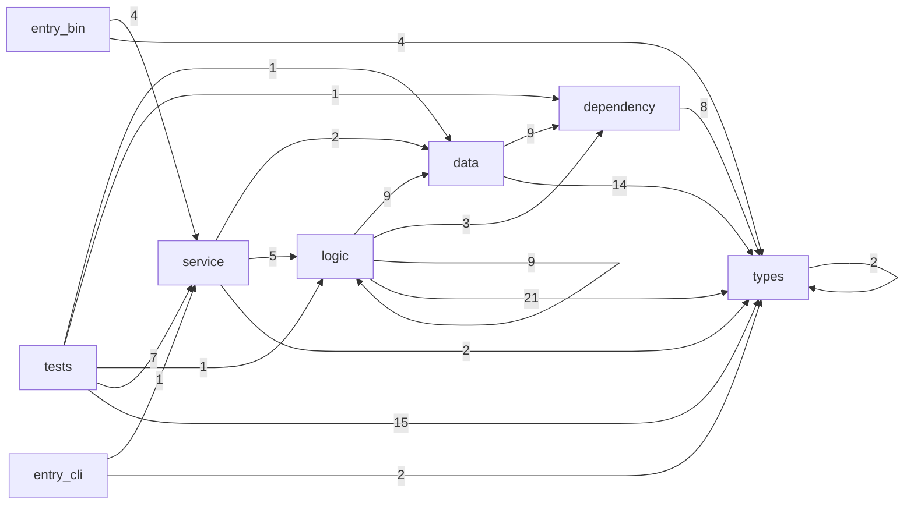

# Call Patterns Inventory

## Layer-to-Layer Call Edges (from Rust imports)

| From Layer | To Layer | Edge Count |
|---|---|---:|
| data | dependency | 9 |
| data | types | 14 |
| dependency | types | 8 |
| entry_bin | service | 4 |
| entry_bin | types | 4 |
| entry_cli | service | 1 |
| entry_cli | types | 2 |
| logic | data | 9 |
| logic | dependency | 3 |
| logic | logic | 9 |
| logic | types | 21 |
| service | data | 2 |
| service | logic | 5 |
| service | types | 2 |
| tests | data | 1 |
| tests | dependency | 1 |
| tests | logic | 1 |
| tests | service | 7 |
| tests | types | 15 |
| types | types | 2 |

## Mermaid (Aggregated Layer Calls)

## Full File-Level Edge List

| From File | Line | To Top Module | To Submodule | To Layer | Snippet |
|---|---:|---|---|---|---|
| src/bin/guess_accuracy_benchmark.rs | 7 | service | tooling_entry | service | use unredact::service::tooling_entry::default_name_dictionary_entries; |
| src/bin/guess_accuracy_benchmark.rs | 8 | service | unredact_cli_entry | service | use unredact::service::unredact_cli_entry::{run_from_paths, UnredactServiceConfig}; |
| src/bin/guess_accuracy_benchmark.rs | 9 | types | guess_types | types | use unredact::types::guess_types::{GuessConfig, GuessReport, RedactionGuess}; |
| src/bin/guess_accuracy_benchmark.rs | 10 | types | visualizer_config | types | use unredact::types::visualizer_config::VisualizerConfig; |
| src/bin/pdf_to_png.rs | 4 | service | tooling_entry | service | use unredact::service::tooling_entry::ToolingPdfRenderer; |
| src/bin/visual_score_impact_benchmark.rs | 7 | service | tooling_entry | service | use unredact::service::tooling_entry::{ |
| src/bin/visual_score_impact_benchmark.rs | 11 | types | guess_types | types | use unredact::types::guess_types::{GuessConfig, GuessReport, RedactionGuess}; |
| src/bin/visual_score_impact_benchmark.rs | 12 | types | redaction_types | types | use unredact::types::redaction_types::{ |
| src/data/fonts_data.rs | 1 | dependency | pdf_font_occurrence_accessor | dependency | use crate::dependency::pdf_font_occurrence_accessor::{ |
| src/data/fonts_data.rs | 4 | dependency | pdf_font_run_accessor | dependency | use crate::dependency::pdf_font_run_accessor::build_font_run_report_from_input_name; |
| src/data/fonts_data.rs | 5 | types | file_types | types | use crate::types::file_types::{ |
| src/data/guess_validation_data.rs | 3 | dependency | file_store | dependency | use crate::dependency::file_store::FileStore; |
| src/data/guess_validation_data.rs | 4 | types | file_types | types | use crate::types::file_types::FontDetectionReport; |
| src/data/guess_validation_data.rs | 5 | types | guess_types | types | use crate::types::guess_types::GuessReport; |
| src/data/guess_validation_data.rs | 6 | types | redaction_types | types | use crate::types::redaction_types::RedactionReport; |
| src/data/local_file_workflow_data.rs | 3 | dependency | file_store | dependency | use crate::dependency::file_store::FileStore; |
| src/data/redactions_data.rs | 1 | dependency | hayro_renderer | dependency | use crate::dependency::hayro_renderer::HayroRenderer; |
| src/data/redactions_data.rs | 2 | dependency | pdf_redaction_accessor | dependency | use crate::dependency::pdf_redaction_accessor::PdfFileRetriever as DependencyPdfFileRetriever; |
| src/data/redactions_data.rs | 3 | dependency | pdf_redaction_accessor | dependency | use crate::dependency::pdf_redaction_accessor::RedactionDataRetriever as DependencyRedactionDataRetriever; |
| src/data/redactions_data.rs | 4 | types | redaction_types | types | use crate::types::redaction_types::{ |
| src/data/result_data_publisher.rs | 3 | dependency | file_store | dependency | use crate::dependency::file_store::FileStore; |
| src/data/visualization_data.rs | 5 | dependency | pdf_annotator | dependency | use crate::dependency::pdf_annotator::PdfAnnotator; |
| src/data/visualization_data.rs | 6 | types | file_types | types | use crate::types::file_types::{FontAsset, FontRunReport, FontTextRun, Rect as FontRect}; |
| src/data/visualization_data.rs | 7 | types | guess_types | types | use crate::types::guess_types::{GuessReport, RedactionGuess}; |
| src/data/visualization_data.rs | 8 | types | redaction_types | types | use crate::types::redaction_types::{Rect, RedactionKind, RedactionReport}; |
| src/data/visualization_data.rs | 9 | types | text_overlay | types | use crate::types::text_overlay::TextOverlay; |
| src/data/visualization_data.rs | 10 | types | visualizer_config | types | use crate::types::visualizer_config::VisualizerConfig; |
| src/data/visualization_data.rs | 785 | types | file_types | types | use crate::types::file_types::FontRunReport; |
| src/data/visualization_data.rs | 786 | types | guess_types | types | use crate::types::guess_types::{GuessCandidate, GuessContext, GuessReport, RedactionGuess}; |
| src/data/visualization_data.rs | 787 | types | redaction_types | types | use crate::types::redaction_types::{ |
| src/data/visualization_data.rs | 790 | types | visualizer_config | types | use crate::types::visualizer_config::VisualizerConfig; |
| src/dependency/hayro_renderer.rs | 8 | types | redaction_types | types | use crate::types::redaction_types::{PdfRenderer, RenderedPage}; |
| src/dependency/pdf_annotator.rs | 3 | types | redaction_types | types | use crate::types::redaction_types::Rect; |
| src/dependency/pdf_annotator.rs | 4 | types | text_overlay | types | use crate::types::text_overlay::TextOverlay; |
| src/dependency/pdf_font_occurrence_accessor.rs | 1 | types | file_types | types | use crate::types::file_types::{ |
| src/dependency/pdf_font_occurrence_accessor.rs | 597 | types | file_types | types | use crate::types::file_types::{InputFileKind, TextSourceKind}; |
| src/dependency/pdf_font_run_accessor.rs | 1 | types | file_types | types | use crate::types::file_types::{FontAsset, FontRunReport, FontTextRun, Rect}; |
| src/dependency/pdf_redaction_accessor.rs | 4 | types | redaction_types | types | use crate::types::redaction_types::{ |
| src/dependency/pdf_redaction_accessor.rs | 1941 | types | redaction_types | types | use crate::types::redaction_types::{ |
| src/logic/dictionary_list_convertion_component.rs | 1 | data | dictionary_data | data | use crate::data::dictionary_data::DictionaryData; |
| src/logic/file_byte_convertion_component.rs | 1 | logic | types | logic | use crate::logic::types::BytesPipelineOutputs; |
| src/logic/local_file_workflow_component.rs | 3 | data | local_file_workflow_data | data | use crate::data::local_file_workflow_data::LocalFileWorkflowData; |
| src/logic/local_file_workflow_component.rs | 4 | data | result_data_publisher | data | use crate::data::result_data_publisher::{ |
| src/logic/redaction_guessing_component.rs | 1 | data | fonts_data | data | use crate::data::fonts_data::FontsData; |
| src/logic/redaction_guessing_component.rs | 2 | data | redactions_data | data | use crate::data::redactions_data::RedactionsData; |
| src/logic/redaction_guessing_component.rs | 3 | logic | time | logic | use crate::logic::time::Instant; |
| src/logic/redaction_guessing_component.rs | 4 | logic | types | logic | use crate::logic::types::{BytesPipelineOutputs, BytesPipelineRequest, VisualizationPayload}; |
| src/logic/redaction_guessing_component.rs | 5 | types | redaction_types | types | use crate::types::redaction_types::{RedactionFinderConfig, RedactionMode}; |
| src/logic/redaction_guessing_component.rs | 100 | dependency | pdf_font_run_accessor | dependency | use crate::dependency::pdf_font_run_accessor::build_font_run_report_from_input_name; |
| src/logic/redaction_guessing_component.rs | 101 | logic | time | logic | use crate::logic::time::Instant; |
| src/logic/redaction_guessing_component.rs | 102 | types | file_types | types | use crate::types::file_types::{FontAsset, FontRunReport, FontTextRun, Rect as FontRect}; |
| src/logic/redaction_guessing_component.rs | 103 | types | guess_types | types | use crate::types::guess_types::{ |
| src/logic/redaction_guessing_component.rs | 106 | types | redaction_types | types | use crate::types::redaction_types::{ |
| src/logic/redaction_guessing_component.rs | 3692 | logic | redaction_guessing_component | logic | use crate::logic::redaction_guessing_component::{ |
| src/logic/redaction_guessing_component.rs | 3695 | types | guess_types | types | use crate::types::guess_types::GuessConfig; |
| src/logic/redaction_guessing_component.rs | 3696 | types | redaction_types | types | use crate::types::redaction_types::{RedactionFinderConfig, RedactionMode}; |
| src/logic/redaction_guessing_component.rs | 3833 | data | redactions_data | data | use crate::data::redactions_data::{PdfFileRetriever, RedactionDataRetriever}; |
| src/logic/redaction_guessing_component.rs | 3834 | logic | time | logic | use crate::logic::time::Instant; |
| src/logic/redaction_guessing_component.rs | 3835 | types | redaction_types | types | use crate::types::redaction_types::{ |
| src/logic/redaction_guessing_component.rs | 4405 | data | redactions_data | data | use crate::data::redactions_data::RedactionDataRetriever; |
| src/logic/redaction_guessing_component.rs | 4406 | types | redaction_types | types | use crate::types::redaction_types::{ |
| src/logic/redaction_guessing_component.rs | 4654 | data | visualization_data | data | use crate::data::visualization_data::{VisualizationData, VisualizationInputs}; |
| src/logic/redaction_guessing_component.rs | 4655 | dependency | hayro_renderer | dependency | use crate::dependency::hayro_renderer::HayroRenderer; |
| src/logic/redaction_guessing_component.rs | 4656 | dependency | pdf_annotator | dependency | use crate::dependency::pdf_annotator::PdfAnnotator; |
| src/logic/redaction_guessing_component.rs | 4657 | logic | time | logic | use crate::logic::time::Instant; |
| src/logic/redaction_guessing_component.rs | 4658 | types | file_types | types | use crate::types::file_types::FontRunReport; |
| src/logic/redaction_guessing_component.rs | 4659 | types | guess_types | types | use crate::types::guess_types::{GuessReport, RedactionGuess}; |
| src/logic/redaction_guessing_component.rs | 4660 | types | redaction_types | types | use crate::types::redaction_types::{PdfRenderer as _, Rect, RedactionReport, RenderedPage}; |
| src/logic/redaction_guessing_component.rs | 4661 | types | text_overlay | types | use crate::types::text_overlay::TextOverlay; |
| src/logic/redaction_guessing_component.rs | 5927 | logic | redaction_guessing_component | logic | use crate::logic::redaction_guessing_component::{ |
| src/logic/redaction_guessing_component.rs | 5931 | types | guess_types | types | use crate::types::guess_types::GuessConfig; |
| src/logic/redaction_guessing_component.rs | 5932 | types | redaction_types | types | use crate::types::redaction_types::{RedactionFinderConfig, RedactionMode}; |
| src/logic/types/mod.rs | 3 | types | file_types | types | use crate::types::file_types::{FontDetectionReport, FontRunReport}; |
| src/logic/types/mod.rs | 4 | types | guess_types | types | use crate::types::guess_types::{GuessConfig, GuessReport}; |
| src/logic/types/mod.rs | 5 | types | redaction_types | types | use crate::types::redaction_types::RedactionReport; |
| src/logic/types/mod.rs | 6 | types | visualizer_config | types | use crate::types::visualizer_config::VisualizerConfig; |
| src/logic/visualization_render_component.rs | 1 | data | visualization_data | data | use crate::data::visualization_data::VisualizationData; |
| src/logic/visualization_render_component.rs | 2 | logic | types | logic | use crate::logic::types::VisualizationPayload; |
| src/logic/visualization_render_component.rs | 3 | types | guess_types | types | use crate::types::guess_types::GuessReport; |
| src/logic/visualization_render_component.rs | 4 | types | redaction_types | types | use crate::types::redaction_types::RedactionReport; |
| src/logic/visualization_render_component.rs | 5 | types | visualizer_config | types | use crate::types::visualizer_config::VisualizerConfig; |
| src/main.rs | 4 | service | unredact_cli_entry | service | use unredact::service::unredact_cli_entry::{ |
| src/main.rs | 7 | types | guess_types | types | use unredact::types::guess_types::GuessConfig; |
| src/main.rs | 8 | types | visualizer_config | types | use unredact::types::visualizer_config::VisualizerConfig; |
| src/service/tooling_entry.rs | 3 | data | dictionary_data | data | use crate::data::dictionary_data::DictionaryData; |
| src/service/tooling_entry.rs | 4 | data | redactions_data | data | use crate::data::redactions_data::{PdfFileRetriever, RedactionDataRetriever as _}; |
| src/service/tooling_entry.rs | 5 | logic |  | logic | use crate::logic::{run_guess_from_bytes, RunGuessFromBytesRequest}; |
| src/service/tooling_entry.rs | 6 | types | guess_types | types | use crate::types::guess_types::{GuessConfig, GuessReport}; |
| src/service/tooling_entry.rs | 7 | types | redaction_types | types | use crate::types::redaction_types::{ |
| src/service/unredact_cli_entry.rs | 5 | logic | time | logic | use crate::logic::time::Instant; |
| src/service/unredact_cli_entry.rs | 6 | logic |  | logic | use crate::logic::{ |
| src/service/unredact_web_entry.rs | 3 | logic | time | logic | use crate::logic::time::Instant; |
| src/service/unredact_web_entry.rs | 4 | logic |  | logic | use crate::logic::{ |
| src/types/guess_types.rs | 3 | types | redaction_types | types | use crate::types::redaction_types::Rect; |
| src/types/text_overlay.rs | 1 | types | redaction_types | types | use crate::types::redaction_types::Rect; |
| tests/dictionary_entry_format_behavior.rs | 6 | service | unredact_cli_entry | service | use unredact::service::unredact_cli_entry::{run_from_paths, UnredactServiceConfig}; |
| tests/dictionary_entry_format_behavior.rs | 7 | types | guess_types | types | use unredact::types::guess_types::{GuessConfig, GuessReport, RedactionGuess}; |
| tests/dictionary_entry_format_behavior.rs | 8 | types | visualizer_config | types | use unredact::types::visualizer_config::VisualizerConfig; |
| tests/efta00038617_guessing.rs | 6 | service | unredact_cli_entry | service | use unredact::service::unredact_cli_entry::{run_from_paths, UnredactServiceConfig}; |
| tests/efta00038617_guessing.rs | 7 | types | guess_types | types | use unredact::types::guess_types::{GuessConfig, GuessReport, RedactionGuess}; |
| tests/efta00038617_guessing.rs | 8 | types | visualizer_config | types | use unredact::types::visualizer_config::VisualizerConfig; |
| tests/efta00101126_guessing.rs | 5 | service | unredact_cli_entry | service | use unredact::service::unredact_cli_entry::{run_from_paths, UnredactServiceConfig}; |
| tests/efta00101126_guessing.rs | 6 | types | guess_types | types | use unredact::types::guess_types::{GuessConfig, GuessReport}; |
| tests/efta00101126_guessing.rs | 7 | types | visualizer_config | types | use unredact::types::visualizer_config::VisualizerConfig; |
| tests/generalization_smoke.rs | 5 | service | unredact_cli_entry | service | use unredact::service::unredact_cli_entry::{run_from_paths, UnredactServiceConfig}; |
| tests/generalization_smoke.rs | 6 | types | guess_types | types | use unredact::types::guess_types::{GuessConfig, GuessReport}; |
| tests/generalization_smoke.rs | 7 | types | visualizer_config | types | use unredact::types::visualizer_config::VisualizerConfig; |
| tests/integration_black_box_boundary.rs | 4 | logic |  | logic | "use unredact::logic::", |
| tests/integration_black_box_boundary.rs | 5 | dependency |  | dependency | "use unredact::dependency::", |
| tests/integration_black_box_boundary.rs | 6 | data |  | data | "use unredact::data::", |
| tests/raster_api.rs | 5 | service | unredact_cli_entry | service | use unredact::service::unredact_cli_entry::{run_from_paths, UnredactServiceConfig}; |
| tests/raster_api.rs | 6 | types | guess_types | types | use unredact::types::guess_types::GuessConfig; |
| tests/raster_api.rs | 7 | types | redaction_types | types | use unredact::types::redaction_types::{RedactionKind, RedactionReport}; |
| tests/raster_api.rs | 8 | types | visualizer_config | types | use unredact::types::visualizer_config::VisualizerConfig; |
| tests/web_entry.rs | 5 | service | unredact_web_entry | service | use unredact::service::unredact_web_entry::{run, UnredactWebConfig, UnredactWebRequest}; |
| tests/web_entry.rs | 6 | types | guess_types | types | use unredact::types::guess_types::{GuessConfig, GuessReport}; |
| tests/web_entry.rs | 7 | types | visualizer_config | types | use unredact::types::visualizer_config::VisualizerConfig; |
| tests/web_entry_dto_boundary.rs | 3 | service | unredact_web_entry | service | use unredact::service::unredact_web_entry::{ |
| tests/web_entry_dto_boundary.rs | 6 | types | guess_types | types | use unredact::types::guess_types::GuessConfig; |
| tests/web_entry_dto_boundary.rs | 7 | types | visualizer_config | types | use unredact::types::visualizer_config::VisualizerConfig; |

