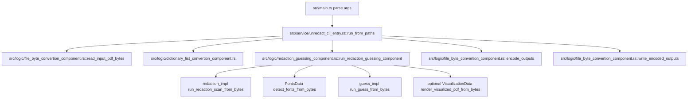
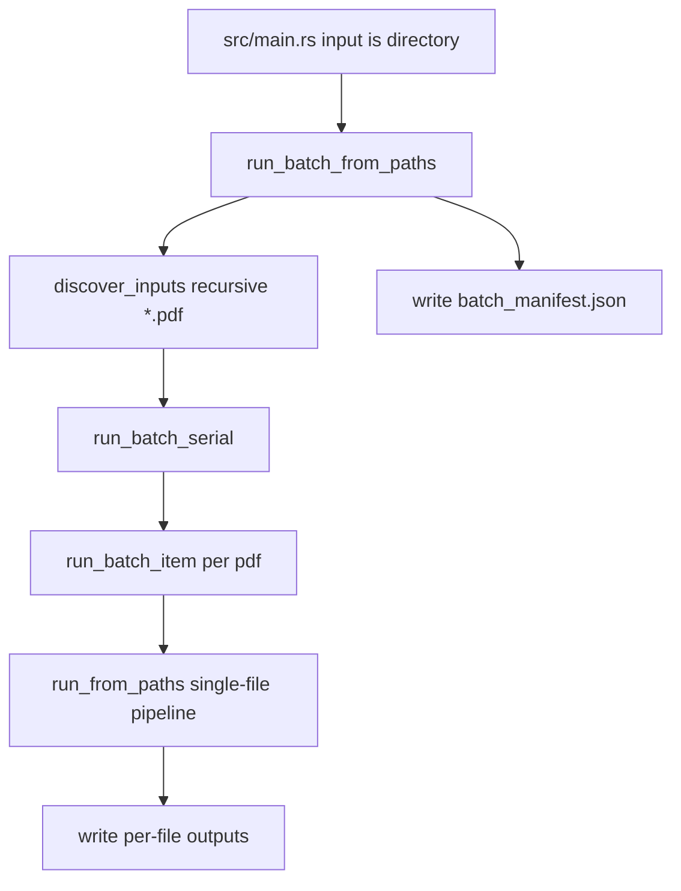
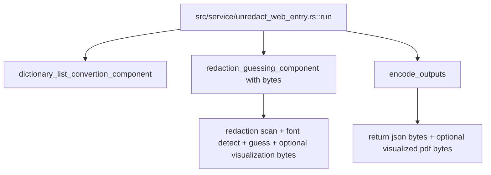
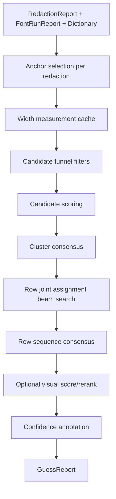
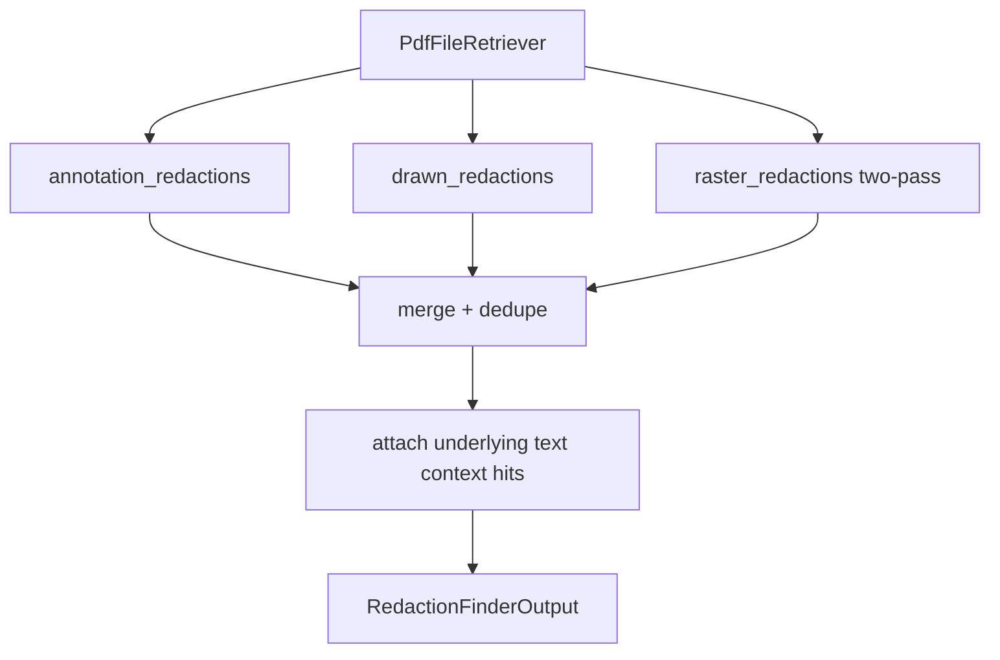
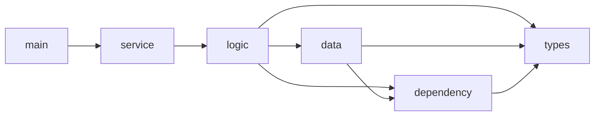

# UnRedact Service Architecture, Call Flows, and Pseudocode

## Scope
This document describes the current runtime code under `src/` (33 Rust files).  
It is intended as a fast onboarding map: what each file does, how calls flow, and where dependencies sit.

## Layer Model
The service currently follows this practical layering:

1. `service` entrypoints accept external inputs (CLI paths or web bytes).
2. `logic` components normalize inputs and orchestrate the pipeline.
3. `data` adapters mediate IO and serialization boundaries.
4. `dependency` adapters talk to concrete libraries (PDF parse/render/annotate/filesystem).
5. `types` define shared contracts.

## Call Pattern Visuals

### 1) CLI Single-File Flow


### 2) CLI Directory Flow


### 3) Web Bytes Flow


### 4) Guess Engine Flow (Inside `redaction_guessing_component`)


### 5) Redaction Scan Flow


## Dependency Trees

### A) Module Tree
```text
src/
  main.rs
  lib.rs
  bin/
    guess_accuracy_benchmark.rs
    pdf_to_png.rs
    visual_score_impact_benchmark.rs
  service/
    mod.rs
    unredact_cli_entry.rs
    unredact_web_entry.rs
  logic/
    mod.rs
    dictionary_list_convertion_component.rs
    file_byte_convertion_component.rs
    redaction_guessing_component.rs
    types/mod.rs
  data/
    mod.rs
    default_name_dictionary.rs
    dictionary_data.rs
    fonts_data.rs
    guess_validation_data.rs
    redactions_data.rs
    visualization_data.rs
  dependency/
    mod.rs
    file_store.rs
    hayro_renderer.rs
    pdf_annotator.rs
    pdf_font_occurrence_accessor.rs
    pdf_font_run_accessor.rs
    pdf_redaction_accessor.rs
  types/
    mod.rs
    file_types.rs
    guess_types.rs
    redaction_types.rs
    text_overlay.rs
    visualizer_config.rs
```

### B) Inter-Module Dependency Tree (Simplified)


### C) File-Level High-Value Edges
```text
src/main.rs
  -> src/service/unredact_cli_entry.rs

src/service/unredact_cli_entry.rs
  -> src/logic/file_byte_convertion_component.rs
  -> src/logic/dictionary_list_convertion_component.rs
  -> src/logic/redaction_guessing_component.rs
  -> src/logic/types/mod.rs

src/service/unredact_web_entry.rs
  -> src/logic/dictionary_list_convertion_component.rs
  -> src/logic/redaction_guessing_component.rs
  -> src/logic/file_byte_convertion_component.rs
  -> src/logic/types/mod.rs

src/logic/redaction_guessing_component.rs
  -> src/data/redactions_data.rs
  -> src/data/fonts_data.rs
  -> src/data/visualization_data.rs
  -> src/dependency/pdf_font_run_accessor.rs
  -> src/dependency/hayro_renderer.rs
  -> src/dependency/pdf_annotator.rs
  -> src/types/*

src/data/redactions_data.rs
  -> src/dependency/pdf_redaction_accessor.rs
  -> src/dependency/hayro_renderer.rs
  -> src/dependency/file_store.rs

src/data/fonts_data.rs
  -> src/dependency/pdf_font_occurrence_accessor.rs
  -> src/dependency/pdf_font_run_accessor.rs
  -> src/dependency/file_store.rs

src/data/visualization_data.rs
  -> src/dependency/pdf_annotator.rs
  -> src/dependency/file_store.rs
  -> src/types/*
```

## Very Simplified Pseudocode by File

### `src/lib.rs`
```text
set strict clippy lint gates
expose top-level modules: data, dependency, logic, service, types
```

### `src/main.rs`
```text
parse CLI args (input, output_dir, dictionary, toggles)
build UnredactServiceConfig defaults
if input is directory:
  run_batch_from_paths(...)
  print batch summary
else:
  run_from_paths(...)
  print output folder
```

### `src/bin/guess_accuracy_benchmark.rs`
```text
define benchmark targets for known PDFs
parse benchmark flags (out, repeats, determinism options)
for each repeat:
  run pipeline on EFTA00101126 and EFTA00038617
  compute ranking metrics (r@1/r@5/r@20/mrr/mean rank)
  aggregate visual, rerank, timing, candidate, quality metrics
  capture run snapshots and hashes
compute cross-run consistency metrics (hash, top1 agreement, top5 jaccard, rank stddev)
print metric definitions + results
write JSON report (and optional consistency JSON)
```

### `src/bin/pdf_to_png.rs`
```text
parse args (input, page/all_pages, output, output_dir, dpi)
create HayroRenderer from PDF
if all_pages:
  render each page to RGBA at dpi
  save each PNG with numbered naming
else:
  render requested page
  save one PNG to provided/default path
```

### `src/bin/visual_score_impact_benchmark.rs`
```text
parse benchmark options for synthetic random-word redactions
load PDF bytes and extract text hits for chosen page
build candidate target words + large dictionary
for each trial:
  sample non-overlapping targets
  synthesize RedactionReport from sampled targets
  run guessing once with visual score off and once on
  compare ranks for each target
summarize no-visual vs visual metrics + pairwise wins/losses
write JSON report
```

### `src/service/mod.rs`
```text
declare service entry modules: unredact_cli_entry, unredact_web_entry
```

### `src/service/unredact_cli_entry.rs`
```text
define config/request/output structs for CLI pipeline and batch mode
run_from_paths: wrap path inputs into request then call run
run:
  map service config -> PipelineConfig
  build output file paths
  convert dictionary input to list
  read pdf bytes
  call run_redaction_guessing_component(bytes request)
  encode and write output files
run_batch:
  discover pdfs recursively
  run each file serially
  collect per-file results
  write batch_manifest.json
```

### `src/service/unredact_web_entry.rs`
```text
define bytes-in/bytes-out request and response
convert optional dictionary file bytes into dictionary list
call run_redaction_guessing_component with bytes request
encode outputs to json bytes
return json payloads + optional visualized pdf bytes
```

### `src/logic/mod.rs`
```text
declare logic components and shared logic types
re-export key orchestration functions/types for service layer
```

### `src/logic/types/mod.rs`
```text
define PipelineConfig shared by CLI and Web entries
define output file path bundle
define standardized bytes request and bytes outputs for orchestrator
```

### `src/logic/dictionary_list_convertion_component.rs`
```text
accept dictionary input as file path, file bytes, or missing
if file path: load dictionary from filesystem via DictionaryData
if file bytes: parse from bytes via DictionaryData
if missing: load built-in fallback dictionary
return normalized dictionary entries + diagnostics
```

### `src/logic/file_byte_convertion_component.rs`
```text
read_input_pdf_bytes(path) via RedactionsData
build output paths for redactions/fonts/guesses/visualized pdf
encode pipeline outputs structs into pretty json bytes
write encoded outputs to disk (+ visualized pdf if present)
```

### `src/logic/redaction_guessing_component.rs`
```text
run_redaction_guessing_component:
  run redaction scan from pdf bytes (annotation/drawn/raster)
  build redaction report
  detect fonts from bytes
  run guess engine from bytes
  append timing diagnostics
  optionally render visualized pdf bytes
  return bytes pipeline outputs

guess_impl:
  build font runs and PDF width tables
  for each redaction:
    find anchor pair (two-sided preferred, one-sided recovery)
    measure dictionary candidate widths (asset -> width table -> core font -> fallback)
    filter candidates by char units/context/shape/box/anchor constraints
    score and rank candidates
  apply cluster consensus + joint row assignment + row sequence consensus
  optional visual scoring/reranking pass
  compute confidence factors and finalize GuessReport

redaction_impl:
  run annotation and drawn redaction extractors
  run raster redaction detection with two-pass dpi strategy
  attach underlying text context around each redaction
  dedupe and return sorted report

visual_guess_score_impl:
  build overlays for guesses
  crop per-page regions for tile-like rendering
  render base and overlay variants
  pixel-compare windows to compute visual quality
  optionally rerank top candidates by blended geometric+visual score
  set visual diagnostics and optional row dropping
```

### `src/data/mod.rs`
```text
declare data adapters
re-export data traits and concrete adapters
```

### `src/data/default_name_dictionary.rs`
```text
define compile-time static fallback dictionary list (names)
used when no dictionary file/bytes is supplied
```

### `src/data/dictionary_data.rs`
```text
load dictionary from file bytes or fallback static list
create case variants (original/lower/upper/title)
normalize and dedupe entries with deterministic ordering
return dictionary + diagnostics (source and size)
```

### `src/data/fonts_data.rs`
```text
detect fonts from file path or bytes via font occurrence accessor
finalize report counts/distinct fonts; optionally hide occurrences
load detailed font runs (text runs + assets) from bytes for guessing/visualization
write fonts json report
```

### `src/data/guess_validation_data.rs`
```text
read redactions json + fonts json from disk
deserialize into structs for guessing path-based mode
write guesses json report
```

### `src/data/redactions_data.rs`
```text
read input bytes and write redactions json
create renderer from bytes (Hayro)
wrap dependency PdfFileRetriever behind data-layer trait
forward page/annotation/drawn/raster/text-hit retrieval calls
```

### `src/data/visualization_data.rs`
```text
load pdf bytes + redaction boxes + text overlays
build overlays from guesses and font runs
for anchor-pair rows: draw left + guess + right aligned text triplet
for raster redactions: compute in-box text layout and baseline
annotate PDF with rectangles and text overlays via PdfAnnotator
write visualized pdf bytes
```

### `src/dependency/mod.rs`
```text
declare dependency adapters for file IO, rendering, PDF extraction, annotation
```

### `src/dependency/file_store.rs`
```text
read bytes from filesystem path
write bytes to filesystem path (ensures parent dirs)
validate read requests for trait-based access
```

### `src/dependency/hayro_renderer.rs`
```text
load PDF into hayro backend
render a requested page to RGBA at target dpi
return RenderedPage (width/height/dpi/pixels)
```

### `src/dependency/pdf_annotator.rs`
```text
load PDF bytes with lopdf
group rect and text overlays by page
append drawing/text operators into page content streams
save and return annotated PDF bytes
```

### `src/dependency/pdf_font_occurrence_accessor.rs`
```text
classify input kind and default text source
for pdfs:
  parse page resources/content operations
  track text state (font, matrix, in-text)
  emit FontOccurrence records for show-text operations
normalize subset font names and split family/variant
return FileFontReport with occurrences
```

### `src/dependency/pdf_font_run_accessor.rs`
```text
parse pdf pages and font resources
extract embedded font bytes and units_per_em into FontAsset list
walk text operators with full text state (Tf/Tm/Td/TJ/Tj/Tc/Tw/Tz/TL)
shape text with rustybuzz using kern/liga/clig
apply PDF spacing adjustments
emit FontTextRun with bbox, widths, and per-char advances
return FontRunReport
```

### `src/dependency/pdf_redaction_accessor.rs`
```text
build PdfFileRetriever from pdf bytes + optional renderer
annotation_redactions:
  scan Annots dictionaries for redact-like subtype/fields
  emit annotation redaction boxes

drawn_redactions:
  parse page and xobject content streams
  track graphics fill state and path state
  detect filled black rectangles/path-rectangles

raster_redactions:
  render page to grayscale (capped dpi)
  detect dark connected regions
  split merged bars via dark-run profile
  map pixel boxes back to PDF coordinates

underlying_text_hits:
  parse text show operators and approximate word bboxes
```

### `src/types/mod.rs`
```text
declare shared type modules and re-export common types
```

### `src/types/file_types.rs`
```text
define font-processing domain structs/enums
include file kind and text source classifications
define FontRunReport/FontTextRun/FontAsset schemas
provide utility aggregation helpers for font counts/distinct fonts
```

### `src/types/guess_types.rs`
```text
define GuessConfig (visual scoring flags)
define GuessReport/RedactionGuess/GuessCandidate/GuessContext schemas
store context, scoring diagnostics, and visual metrics per guess row
```

### `src/types/redaction_types.rs`
```text
define geometry Rect and redaction domain models
define RedactionFinderConfig and modes
define renderer abstraction trait (PdfRenderer) and RenderedPage
```

### `src/types/text_overlay.rs`
```text
define text overlay payload used for visualization and visual scoring
```

### `src/types/visualizer_config.rs`
```text
define visualization style config (box color, text color, border width)
```

## Quick Runtime Narrative
```text
Input arrives from CLI path(s) or Web bytes.
Service converts dictionary input into a normalized string list.
Logic orchestrator scans redactions, extracts fonts/runs, and scores dictionary candidates.
Context anchors + width models drive fast candidate filtering.
Optional visual scoring reranks near-ties using pixel overlap in rendered tiles.
Outputs are emitted as JSON reports and optional visualized PDF bytes/file.
```
